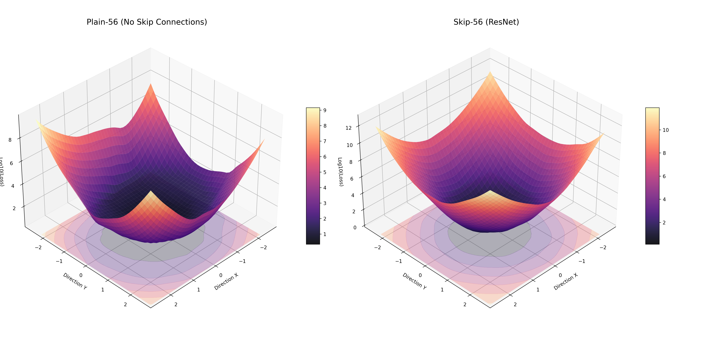
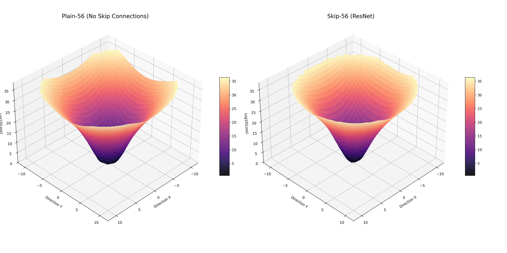

# Deep Dive: ResNet-56 and Global Loss Landscapes

## Training Results (CIFAR-100, 50 Epochs)

At 56 layers, the difference in trainability becomes extreme. The Skip-connection model converges rapidly, while the Plain model struggles significantly with the increased depth.

| Model | Filters | Final Val Acc | Best Loss |
| :--- | :--- | :--- | :--- |
| **Plain-56** | 16-64 | 44.38% | 2.012 |
| **Skip-56 (ResNet)** | 16-64 | **69.66%** | **0.347** |

## Global Loss Landscape Comparison (Wide Range)

### Key Architectural Findings:
1. **Plain-56 (Extreme Chaos)**: In this deep configuration, the landscape outside the center is incredibly turbulent. The "mountainous" peaks and sharp valleys make it nearly impossible for a gradient-based optimizer to find the path to the global minimum.
2. **Skip-56 (Universal Smoothness)**: Even at 56 layers and a wide sampling range, the ResNet landscape remains a well-behaved, smooth bowl. This visualizes why residual learning is so robust to initial weight conditions.

## Conclusion

This confirms that skip connections do not just provide a better "highway" for gradients; they fundamentally **redesign the optimization problem** into one that is visually and mathematically simpler to solve.

### Final Setup:
- **Architecture**: ResNet-56 (56 Layers).
- **Dataset**: CIFAR-100.
- **Viz Range**: $[-2.5, 2.5]$.
- **Ref Method**: Log-Scale Filter Normalization.
